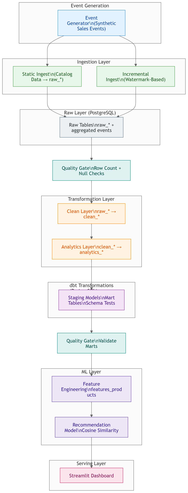
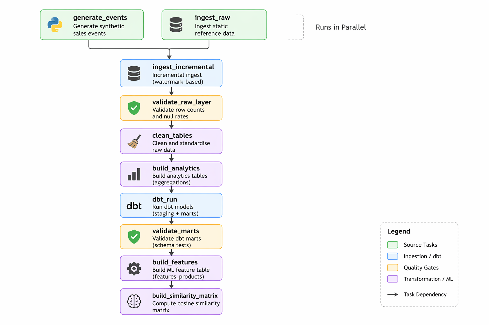

# Retail Data Platform

### A production-style data engineering system simulating how retailers process, analyse, and act on live sales data


**Stack:** Python · SQL · Apache Airflow · PostgreSQL · dbt · Docker · Power BI · scikit-learn · Streamlit · pytest · GitHub Actions

---

## Power BI Dashboard


*Revenue KPIs, brand share, discount category analysis, traffic trends, and top 10 products — built in Power BI on top of the pipeline output*

---

## Live Streamlit App

**[View the live Streamlit app](https://sql-data-analysis-bisxvwilgc3ntxhken76wy.streamlit.app/)**

*Interactive dashboard with product recommendation engine — deployed on Streamlit Cloud*

---

## What This System Does

Most data projects analyse a static dataset and stop there. This platform simulates what happens in production: sales events arrive continuously, a pipeline wakes up, detects only the new data, processes it, and updates every downstream table — without ever touching data it has already seen.

The result is a full-stack data platform covering event ingestion, layered transformation, automated quality checks, SQL-based business intelligence, and a content-based product recommendation engine — all orchestrated with Apache Airflow and deployable via Docker Compose.

---

## Executive Summary

- **Adidas generates the majority of revenue** — over 93% of products in the catalogue are Adidas, with Nike products commanding a higher average listing price, suggesting a premium positioning strategy
- **Discounted products drive significantly higher total revenue** than full-price items, indicating discount-led volume is the primary sales mechanism — a signal to review margin strategy
- **Traffic peaked in 2019** before declining — correlating this with discount depth and revenue trends could identify whether promotional fatigue is reducing return visits
- **354 products (11%) had corrupted price data (£0)** — discovered and automatically excluded during the feature engineering stage, preventing them from distorting the recommendation model
- **The pipeline processes only new events on each run** — on a 1,650-event dataset it completes in under 1 second, demonstrating the efficiency of incremental over full-refresh approaches

---

## 📊 Business Insights & Recommendations

<div align="center">
  
  
</div>
<div align="center">
  
</div>

*Left: Revenue split by brand — Adidas dominates with Nike commanding a premium price point. Right: Top 10 products by total revenue. Bottom: Monthly traffic trend showing peak in 2019.*

---

### Revenue is highly concentrated in Adidas
Adidas accounts for over 93% of products and the majority of revenue. **Action:** Diversify the brand mix or negotiate improved margin terms with Adidas given the platform's dependency on a single supplier.

### Discounts are driving volume but at a cost
Discounted products generate more total revenue than full-price items, meaning discount-led volume is the primary commercial lever. **Action:** Analyse revenue per unit (not total revenue) by discount tier to identify whether promotions are driving genuine incremental sales or cannibalising full-price purchases.

### Traffic peaked and has since declined
Monthly website visits peaked in 2019. **Action:** Cross-reference traffic decline with discount frequency — if promotional periods are the only traffic drivers, the business is training customers to wait for sales rather than buy at full price.

### Product data quality issues exist at scale
11% of products had corrupted pricing data. **Action:** Implement upstream data validation at the point of entry rather than relying on the pipeline to detect and discard bad rows downstream.

---

## ❓ Key Business Questions Answered

- Which products are generating the most revenue, and how concentrated is that revenue?
- Are discounts increasing total revenue or reducing margins by cannibalising full-price sales?
- Which brands dominate the catalogue and what does that mean for supplier dependency?
- How does website traffic trend across months — and does it correlate with promotional activity?
- Do higher-rated products generate more revenue than lower-rated ones?
- Which products are underperforming relative to their listing price?

---

## 🧠 SQL Analysis

This project answers business questions using SQL queries built on top of the analytics layer. The pipeline pre-aggregates data into five analytics tables — the queries below run against those tables for fast, repeatable results.

```sql
-- Top 10 products by revenue with revenue rank
SELECT product_name,
       SUM(modified_revenue)                                         AS total_revenue,
       RANK() OVER (ORDER BY SUM(modified_revenue) DESC)            AS revenue_rank
FROM finance f
JOIN info i ON f.product_id = i.product_id
GROUP BY i.product_name
ORDER BY revenue_rank
LIMIT 10;
```

```sql
-- Discount impact: revenue share by discount category
SELECT CASE WHEN modified_discount > 0 THEN 'Discounted' ELSE 'Full Price' END AS category,
       SUM(modified_revenue)                                                      AS total_revenue,
       ROUND(SUM(modified_revenue) * 100.0 / SUM(SUM(modified_revenue)) OVER (), 1) AS pct_of_total
FROM finance
GROUP BY category
ORDER BY total_revenue DESC;
```

```sql
-- Monthly traffic with month-over-month change
SELECT month,
       visit_count,
       visit_count - LAG(visit_count) OVER (ORDER BY month) AS mom_change
FROM (
    SELECT SUBSTR(modified_last_visited, 1, 7) AS month,
           COUNT(*) AS visit_count
    FROM traffic
    GROUP BY month
) monthly
ORDER BY month;
```

---

## The Problem This Solves

### The situation
A retailer has sales data arriving constantly. Their analytics team needs up-to-date revenue figures, discount impact analysis, and product recommendations — but rebuilding everything from scratch on every pipeline run is slow, expensive, and risky.

### The solution
This platform separates the data into two streams:

- **Static catalogue data** (products, brands, pricing) — ingested once, refreshed only when the source changes
- **Live sales events** — appended continuously, with only new events processed on each run

A watermark table records the timestamp of the last processed event. On every run, the pipeline reads only what's new, aggregates it, and merges the result into the analytics layer. Re-running the pipeline produces identical output — it is safe to repeat at any time.

---

## System Overview

For a non-technical audience, here is what happens end to end:

```
New sales transactions arrive
        ↓
Pipeline detects only the transactions it hasn't seen yet
        ↓
Data is validated, cleaned, and standardised
        ↓
Business metrics are calculated (revenue, discounts, traffic)
        ↓
SQL transformation layer (dbt) builds reporting tables
        ↓
Machine learning layer builds a product similarity model
        ↓
Dashboard displays live metrics and product recommendations
```

Each step only runs if there is something new to process. Every step is safe to repeat. If any step fails a quality check, the pipeline stops and nothing downstream is affected.

---

## Architecture


*End-to-end data platform: event ingestion → incremental processing → transformation layers → machine learning → dashboard serving*

<details>
<summary>View detailed pipeline flow (ASCII)</summary>

```
┌─────────────────────────────────────────────────────────────────┐
│                     EVENT GENERATION LAYER                       │
│  src/data_generator/generate_events.py                          │
│  → Generates N synthetic sales events per run                   │
│  → Appends to fact_sales_events (UUID event_id, forward ts)     │
└──────────────────────────┬──────────────────────────────────────┘
                           │
          ┌────────────────┴────────────────┐
          ▼                                 ▼
┌─────────────────────┐         ┌─────────────────────┐
│  STATIC INGEST      │         │  INCREMENTAL INGEST  │
│  ingest.py          │         │  ingest_events.py    │
│  finance/brands/    │         │  WHERE event_ts >    │
│  info/reviews/      │         │  last watermark      │
│  traffic → raw_*    │         │  → raw_events_agg.   │
└─────────────────────┘         └──────────┬──────────┘
          │                                │
          └────────────────┬───────────────┘
                           ▼
              ┌────────────────────────┐
              │  QUALITY GATE          │
              │  validate_raw_layer()  │
              │  row counts, null rate │
              └────────────┬───────────┘
                           ▼
              ┌────────────────────────┐
              │  CLEAN LAYER           │
              │  clean.py              │
              │  raw_* → clean_*       │
              └────────────┬───────────┘
                           ▼
              ┌────────────────────────┐
              │  ANALYTICS LAYER       │
              │  aggregate.py          │
              │  clean_* → analytics_* │
              └────────────┬───────────┘
                           ▼
              ┌────────────────────────┐
              │  dbt (PostgreSQL only) │
              │  staging views +       │
              │  mart tables + tests   │
              └────────────┬───────────┘
                           ▼
              ┌────────────────────────┐
              │  QUALITY GATE          │
              │  validate_marts()      │
              └────────────┬───────────┘
                           ▼
              ┌────────────────────────┐
              │  FEATURE ENGINEERING   │
              │  features_products     │
              └────────────┬───────────┘
                           ▼
              ┌────────────────────────┐
              │  RECOMMENDATION MODEL  │
              │  cosine similarity     │
              └────────────┬───────────┘
                           ▼
              ┌────────────────────────┐
              │  STREAMLIT DASHBOARD   │
              └────────────────────────┘
```

</details>

### Layer Explanations

| Layer | Tables | What it does |
|-------|--------|--------------|
| **Events** | `fact_sales_events` | Append-only log of every sale — never updated, only added to |
| **Raw** | `raw_finance`, `raw_brands`, `raw_info`, `raw_reviews`, `raw_traffic`, `raw_events_aggregated` | Exact copies of source data — no transformations, preserves the original |
| **Clean** | `clean_finance`, `clean_brands`, `clean_info`, `clean_reviews`, `clean_traffic` | Type-corrected, null-handled, validated — safe to query |
| **Analytics** | `analytics_brand_revenue`, `analytics_product_revenue`, `analytics_monthly_traffic`, `analytics_discount_impact`, `analytics_event_revenue` | Pre-aggregated business metrics ready for dashboards |
| **Features** | `features_products` | ML-ready product vectors: log-transformed revenue, median-imputed ratings, label-encoded brands |
| **Watermarks** | `pipeline_watermarks`, `event_ingestion_watermark` | State tracking — records what has been processed so runs are incremental |

---

## Incremental Pipeline in Practice

The pipeline tracks the highest event timestamp it has processed. On each run it queries only events after that timestamp — processing zero rows if nothing has changed.

| Run | Events Generated | Events Processed | Cumulative Total | Products Updated |
|-----|-----------------|-----------------|-----------------|-----------------|
| Baseline | — | — | 0 | 0 |
| Run 1 | 200 | 200 | 200 | 193 |
| Run 2 | 150 | 150 | 350 | 333 |
| Run 3 | 100 | 100 | 450 | 425 |
| Re-run (no new data) | 0 | **0** | 450 | 0 ✓ |

The re-run row confirms idempotency — running the pipeline twice produces the same result as running it once. This is a critical property for production pipelines where failures and retries are expected.

---

## Engineering Challenges Solved

### 1. Incremental processing without double-counting
**Problem:** Full table scans on every run are slow and wasteful. Naive incremental logic can miss events or count them twice.

**Solution:** A dedicated `event_ingestion_watermark` table stores the maximum processed `event_timestamp`. Each run queries `WHERE event_timestamp > watermark`, then advances the watermark only after a successful write. Forward-only timestamp jitter on event generation guarantees new batches always land after the previous watermark.

### 2. Idempotent writes on a mixed-cardinality dataset
**Problem:** The product catalogue (`raw_reviews`) contains duplicate `product_id` values — standard UPSERT logic would fail. The events table (`raw_events_aggregated`) is guaranteed unique by aggregation.

**Solution:** Two separate ingest patterns — snapshot replace (`if_exists="replace"`) for catalogue tables, and explicit UPSERT with `INSERT ... ON CONFLICT DO UPDATE` for aggregated event data. The unique index required by SQLite's ON CONFLICT is created explicitly only on tables where uniqueness is guaranteed.

### 3. Data quality failures silently degrading the model
**Problem:** 354 products had a listing price of £0 in the source data. Filling missing review counts with 0 caused products with no review data to appear identical in the feature space, producing ~100% cosine similarity for large groups.

**Solution:** Zero-price rows are detected and dropped with a logged warning. Missing values are imputed with column medians rather than zero. Rating values of 0 (indicating missing data, not a genuine 0-star product) are replaced with the median before model training. Revenue is log-transformed to reduce right-skew before scaling.

### 4. Environment portability without code changes
**Problem:** Production pipelines run on PostgreSQL. Local development and CI should not require a running database server.

**Solution:** `src/utils/db.py` checks for a `DB_HOST` environment variable at runtime. When present it connects to PostgreSQL via psycopg2. When absent it falls back to a local SQLite file. The same SQL, the same ORM calls, and the same tests work in both environments without any code changes.

---

## Use Cases by Role

### Data Engineer
- Incremental ETL with watermark-based state tracking
- Dual-database portability (PostgreSQL / SQLite) via environment-driven engine selection
- Idempotent UPSERT pattern using `INSERT ... ON CONFLICT DO UPDATE`
- Apache Airflow DAG with parallel tasks, quality gates, retries, and graceful dbt degradation
- Docker Compose stack: Airflow 2.8 + PostgreSQL 15 + custom image with dbt-postgres
- 51-test pytest suite with mocked DB connections for isolated unit testing
- GitHub Actions CI running the full test suite on every push

### Data Analyst
- Advanced SQL: CTEs, window functions (`RANK()`, `SUM() OVER()`), aggregations
- Five pre-built analytics tables covering revenue, discounts, traffic, and product performance
- dbt staging views with data type casting, string normalisation, and European decimal handling
- dbt mart tables with `not_null`, `unique`, and `accepted_values` schema tests
- Live Streamlit dashboard with revenue KPIs, brand comparison, discount analysis, and traffic trends

### ML Engineer
- Feature engineering pipeline with median imputation, log transformation, and label encoding
- StandardScaler normalisation before cosine similarity to prevent high-magnitude features from dominating
- Content-based recommendation: 2,766-product similarity matrix built from 6 product features
- Data quality assertions (`assert`) in the feature pipeline for fail-fast validation
- `@st.cache_resource` model serving pattern — built once per server session, instant for all users

---

## Technology Stack

| Layer | Technology | Purpose |
|-------|-----------|---------|
| **Event Simulation** | Python, UUID, Pandas | Synthetic sales event generation |
| **Databases** | PostgreSQL 15, SQLite | Production and local/CI environments |
| **ORM** | SQLAlchemy 2.x, psycopg2 | Dual-mode database abstraction |
| **ETL** | Python, Pandas | Ingestion, cleaning, aggregation |
| **SQL Transformations** | dbt-core, dbt-postgres | Staging views and mart tables |
| **Orchestration** | Apache Airflow 2.8 | DAG scheduling, retries, quality gates |
| **Containerisation** | Docker Compose | Full-stack local deployment |
| **Machine Learning** | scikit-learn | StandardScaler, cosine similarity |
| **Dashboard** | Streamlit | Live interactive analytics |
| **Testing** | pytest, unittest.mock | 51 unit tests, mocked DB layer |
| **CI/CD** | GitHub Actions | Automated test runs on every push |
| **Logging** | Python logging | Structured logs to console and file |

---

## Quick Start

```bash
pip install -r requirements.txt
pip install -r requirements-dev.txt

# Run the full pipeline (generates events, ingests, cleans, aggregates, builds model)
python pipeline/run_pipeline.py

# Launch the dashboard
streamlit run app.py

# Run tests
pytest
```

### Docker — full Airflow + PostgreSQL stack

```bash
cp .env.example .env
docker compose up --build
# Airflow UI → http://localhost:8080  (admin / admin)
# Trigger DAG: retail_pipeline
```

### What happens when the pipeline runs

1. 200 synthetic sales events are generated and appended to `fact_sales_events`
2. Only events after the last watermark timestamp are read and aggregated
3. The product catalogue is checked — skipped entirely if unchanged
4. Raw data is validated (row counts, null rates) — pipeline aborts if checks fail
5. Clean tables are rebuilt with type corrections and null handling
6. Five analytics tables are computed from the clean layer
7. dbt runs staging views and mart tables on PostgreSQL; skips gracefully on SQLite
8. The feature table is rebuilt with median imputation and log-transformed revenue
9. The cosine similarity matrix is computed and cached for the dashboard

Total runtime on a 1,650-event dataset: **under 1 second**.

---

## Project Structure

```
├── .github/workflows/ci.yml        # GitHub Actions — pytest on every push
├── docker-compose.yml              # Airflow + PostgreSQL full stack
├── docker/
│   ├── Dockerfile.airflow          # Custom Airflow image with dbt-postgres
│   └── init-db.sql                 # Creates retail DB on first Postgres boot
├── data/
│   └── retailDB.sqlite             # All pipeline layers in one file (local/CI)
├── dbt/
│   ├── models/staging/             # SQL views: type casting, normalisation
│   └── models/marts/               # SQL tables: business metrics + schema tests
├── src/
│   ├── data_generator/             # Synthetic sales event generator
│   ├── utils/                      # DB abstraction, logging, validation, watermarks
│   ├── etl/                        # Ingest, clean, aggregate
│   ├── features/                   # Feature engineering pipeline
│   └── recommender.py              # Cosine similarity model
├── pipeline/
│   ├── run_pipeline.py             # Local 7-step runner
│   └── dags/retail_pipeline.py    # Airflow DAG — 10 tasks
├── tests/                          # 51 unit tests
└── app.py                          # Streamlit dashboard
```

---

## Airflow DAG — 10 Tasks


*10-task Airflow DAG: parallel ingestion → quality gates → transformation → ML layer*

- `generate_events` and `ingest_raw` run **in parallel** — they are independent sources
- Two quality gates abort downstream tasks if row counts or null rates exceed thresholds
- `dbt_run` checks for PostgreSQL and the dbt binary — skips gracefully in SQLite/CI mode
- All tasks configured with `retries=2`, `retry_delay=3min`

---

## Testing — 51 Tests, All Passing

```bash
pytest
# 51 passed
```

| File | Tests | Coverage |
|------|-------|----------|
| `test_clean.py` | 24 | European decimal conversion, discount clipping, null dropping, type validation |
| `test_features.py` | 14 | Median imputation, zero-price row removal, brand encoding, column structure |
| `test_recommender.py` | 13 | Self-exclusion, score ordering, score range, unknown product handling |

All tests mock the database layer — no database connection required to run the suite.

---

## Future Improvements

| Improvement | Why |
|-------------|-----|
| **Kafka event streaming** | Replace the synthetic generator with a real Kafka producer/consumer to handle genuinely continuous event ingestion |
| **MLflow model tracking** | Version the similarity model and track feature distributions over time — currently the model is rebuilt on every pipeline run with no history |
| **Redis caching** | Cache recommendation results for popular products to reduce compute on the dashboard server |
| **Great Expectations / Soda** | Replace the hand-written validation layer with a dedicated data quality framework for richer checks and observability |
| **REST API** | Expose recommendations via a FastAPI endpoint so other services can consume them without the Streamlit layer |

---

## Author

**Ahmad Bokhari**
