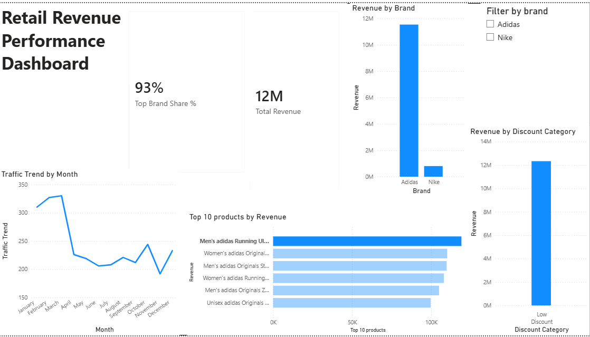
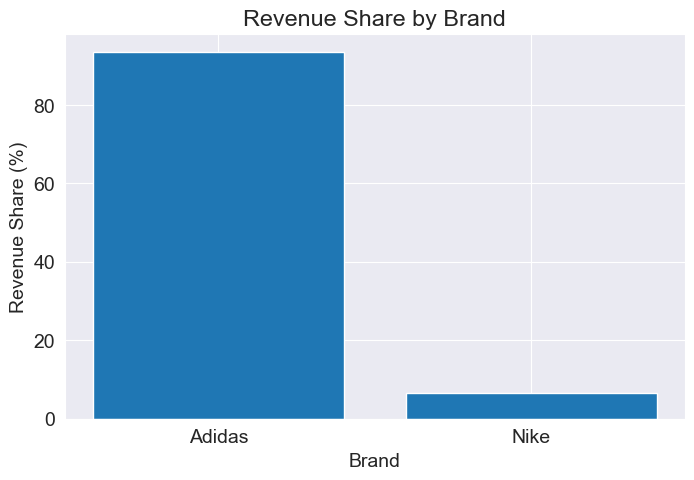
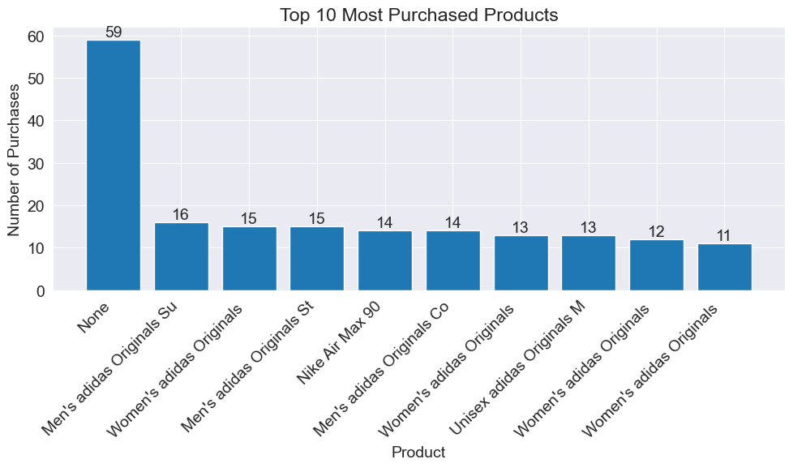
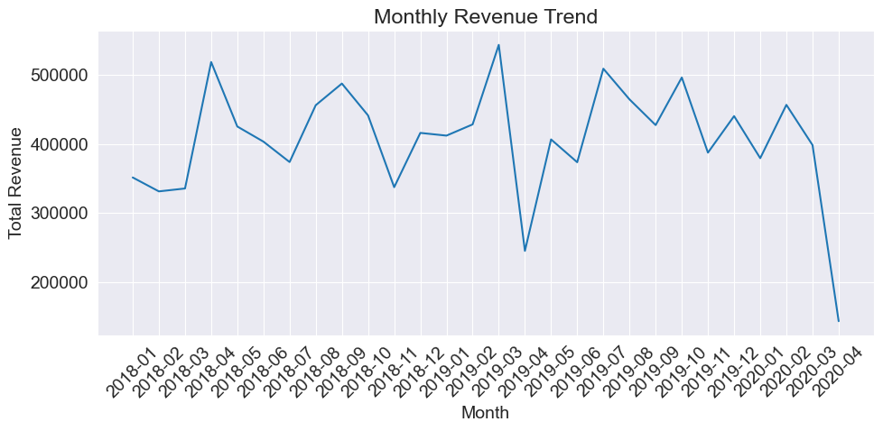

# 📊 Retail Revenue Performance Analysis
### SQL • Python • Streamlit • Power BI • Data Analytics

This project presents an **end-to-end retail data analytics case study** that analyzes brand performance, revenue concentration, pricing strategies, and product-level insights using **SQL, Python, and Business Intelligence dashboards**.

The goal of this project was to simulate a **real-world business analytics workflow**, transforming raw data into **actionable business insights and interactive dashboards**.

---

# 🚀 Live Dashboard

### Streamlit Interactive Dashboard

You can explore the live interactive dashboard here:

🔗 **Streamlit App**  
https://sql-data-analysis-bisxvwilgc3ntxhken76wy.streamlit.app/

The dashboard provides:

- Revenue KPI tracking
- Brand performance analysis
- Discount impact analysis
- Monthly traffic trends
- Top product performance
- Revenue vs product ratings

---

# 📊 Power BI Dashboard

The project also includes a **Power BI executive dashboard** designed for business stakeholders.



Dashboard Features:

- KPI cards for **Total Revenue and Brand Share**
- **Revenue by Brand** comparison
- **Revenue by Discount Category**
- **Monthly Traffic Trend**
- **Top 10 Products by Revenue**
- Interactive **Brand Filter**

---

# 🎯 Business Objectives

The analysis focused on answering key business questions:

- Which brands generate the most revenue?
- How concentrated is revenue across brands?
- Which products drive the highest revenue?
- Does discounting significantly impact revenue?
- How does website traffic trend across months?
- Is revenue concentrated among a small group of products?

The objective was to transform raw transactional data into **strategic insights for retail decision-making**.

---

## 🗂 Dataset

The dataset is stored in a **SQLite relational database** containing multiple tables representing different aspects of retail operations.

### Main Tables

| Table | Description |
|------|-------------|
| `finance` | Revenue, pricing, and discount data |
| `brands` | Brand classification for products |
| `info` | Product information and metadata |
| `reviews` | Customer ratings and reviews |
| `traffic` | Website traffic and product visit activity |

These tables are connected using **product_id**, enabling multi-table analysis of revenue performance, pricing strategies, product popularity, and customer engagement.

The dataset supports analysis of:

- brand revenue contribution
- product-level performance
- pricing and discount strategies
- customer ratings vs revenue
- seasonal traffic trends

This structure simulates a **real-world retail analytics environment**, allowing the project to demonstrate SQL analysis, business intelligence reporting, and data storytelling.
---

# 🔎 Key Business Insights

## 1️⃣ Revenue Concentration Risk

Revenue is **highly concentrated in one brand**.



Key finding:

- **Adidas generates approximately 93% of total revenue**
- Nike contributes only a small portion

This suggests **significant brand dependency risk**.

---
## 🧪 Methodology

This project followed a structured data analytics workflow to transform raw retail data into business insights and interactive dashboards.

**1. Data Exploration**  
The SQLite database was explored to understand table structures, relationships, and available metrics such as revenue, pricing, discounts, product information, customer ratings, and website traffic.

**2. Data Preparation**  
Relevant tables were joined using SQL to create a unified analytical dataset. Data cleaning steps included validating product identifiers, handling missing values, and structuring time-based fields for trend analysis.

**3. SQL Analysis**  
Core analysis was performed using SQL queries with aggregations and joins. Key analyses included revenue by brand, top-performing products, discount impact on revenue, and monthly traffic trends.

**4. Exploratory Analysis (Python)**  
Python (Pandas and Plotly) was used to further analyze the SQL outputs and generate visualizations used in the dashboards.

**5. Dashboard Development**  
Two dashboards were created:
- **Streamlit dashboard** for interactive exploration of KPIs, brand performance, and product insights.
- **Power BI dashboard** designed for executive-level reporting and business decision-making.

The final stage focused on translating analytical results into actionable business insights.

---
# 🔎 Example SQL Analysis

Example query used to calculate revenue contribution by brand.

```sql
SELECT
    b.brand,
    SUM(f.revenue) AS total_revenue
FROM finance f
JOIN brands b
ON f.product_id = b.product_id
GROUP BY b.brand
ORDER BY total_revenue DESC;


## 2️⃣ Total Revenue Performance

Total retail revenue exceeds:

Revenue is primarily driven by **premium product lines**.

---

## 3️⃣ Product Revenue Concentration

A small group of products generates a large share of revenue.



Key insight:

- A handful of products drive the majority of sales
- Indicates strong **product-level demand concentration**

---

## 4️⃣ Pricing & Discount Impact

Discounted products contribute a meaningful portion of revenue.

Key implication:

- Customers appear **price sensitive**
- Discount strategies can significantly influence demand

---

## 5️⃣ Seasonal Revenue Trends

Monthly revenue trends show fluctuations throughout the year.




Observations:

- Mid-year revenue dips
- Recovery toward the final quarter
- Seasonal traffic patterns influence revenue

---

# 📈 Streamlit Dashboard Features

The Streamlit dashboard provides an **interactive analytics interface** including:

- KPI Metrics
- Revenue by Brand
- Revenue by Discount Category
- Monthly Traffic Trends
- Revenue vs Product Ratings
- Top 10 Products by Revenue

Users can interactively explore the data through dynamic visualizations.

---

# ⚙️ Technology Stack

### Data Analysis
- SQL
- SQLite

### Programming
- Python
- Pandas
- Plotly

### Dashboards
- Streamlit
- Power BI

### Development Tools
- Jupyter Notebook
- Git
- GitHub


---

# 💼 Skills Demonstrated

This project demonstrates key data analytics skills:

- Advanced SQL querying
- Data aggregation and joins
- KPI development
- Revenue concentration analysis
- Pricing strategy evaluation
- Data storytelling
- Business intelligence dashboard design
- Python data visualization
- End-to-end analytics workflow

---

# 📊 Business Value

The analysis highlights several strategic insights:

- Heavy dependency on a single brand
- Strong product concentration in revenue generation
- Discount strategies influence purchasing behavior
- Seasonal demand impacts revenue patterns

These findings help support decisions related to:

- Brand diversification
- Pricing strategy
- Product portfolio optimization
- Demand forecasting

---

# 👨‍💻 Author

**Ahmad Bokhakari**

